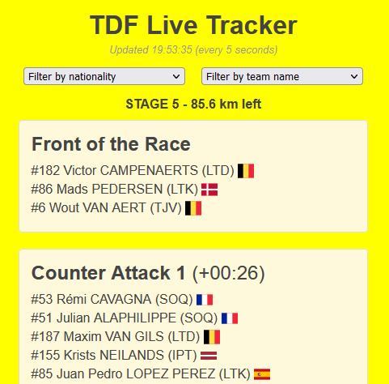

# tdf-live-tracker

Follow the real-time progression of every Tour de France stage.



## Features:

-   Real-time SPA frontend updating every 5 seconds
-   Track groups and their time gap to the race lead
-   Filter riders by nationality and team name
-   Monitor the remaining distance of the stage
-   Easy deployment with Docker Compose

**TODO:**

-   [ ] Support TT stages
-   [ ] Notification at key points in the race e.g. when there's X km left of the stage to watch the final sprint or at the beginning of crucial climbs
-   [ ] Detailed stage profiles with current positions of riders/groups.
-   [ ] Show current and virtual GC
-   [ ] Support all grand tours

## Tech Stack

-   Frontend: React
-   Backend: Node.js
-   Language: Typescript
-   CI/CD: Github Actions
-   Deployment: Docker + Docker Compose

## Local Installation (development only) 💻

The project is separated into a `./client` and a `./server` directory. The following commands should be run for both projects in their respective directories.

```
npm install
npm start
```

Now the client and server will be accessible on a local host port specified in the console output.

## Docker 🐳

### Development

To run the project with Docker in development you can simply use the command:

```
docker compose up
```

This will build and run three containers:

-   `build-client` will build the static files for the React website to the mounted directory `./client/build` and then exit
-   `server` will run the backend API service
-   `nginx` will serve the static files from `.client/build` and proxy requests to the backend API service. The nginx config is defined in `./nginx/default.conf`. NB! This container is only used for development and is not suitable for production. E.g. it listens on port 80 and does not use HTTPS.

### Production

In the docker production setup, it is assumed that a webserver is already running in production and attached to an existing network named `nginx_reverse-proxy`. As mentioned above, the `nginx` container in `docker-compose.override.yml` is only suitable for testing the Docker project in development.

Let the external webserver serve the static files from the directory `./client/build` at the endpoint `/tdf` and proxy requests to the backend API service. Please refer to `./nginx/default.conf` (used in development) for an example of how to configure this in nginx.

Set the `API_BASE_URL` environment variable to the public base URL from which the backend is served e.g. `https://api.example.com`. This is used by the React client to make requests to the backend API.

Finally, run the docker compose project with the production configuration file:

```
docker compose -f docker-compose.yml -f docker-compose.prod.yml up -d
```
